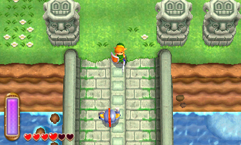
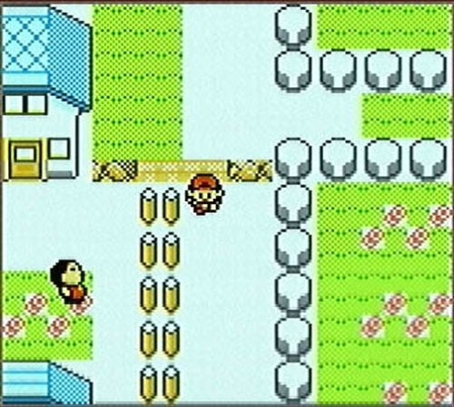

# 2-D Array Extra Credit
In this project, we are going to see how to use 2-D arrays and inheritance to create rich backgrounds such as those used in the earlier Zelda and Pokemon games.

[What is Inheritance?](http://java.sun.com/docs/books/tutorial/java/concepts/inheritance.html) - very basic primer on inheritance in OO languages

[Managing Inheritance](https://docs.oracle.com/javase/tutorial/java/IandI/subclasses.html) - how class hierarchies work
Specifications

## Part One: Import Project

### Clone Project and Set up Commit Template

Begin by cloning the provided project and importing it into your workspace.

`git clone <url for github repository>`

After cloning this repository you want to run these commands

`git checkout -b development`

This will create a branch named development and switch you to it. The development branch is where you will make all your commits.

## Part Two Import Project

In Eclipse, you want to import it as a Gradle project.

Go to File --> Import

Select Gradle, then Existing Gradle Project

Click Next

Click Browse to find your Inheritance_Background and then click Next

Click Override Workspace Settings, and then select Gradle 7.6

Click Next

Once it's finished loading, click Finish

## Part Three: Explore Code and Complete Exercises

Spend some time(10-15min) just exploring the code. Focus on the Area and OurArea classes. Use the exercises to guide your thought process and get the basic level set up

- Get some trees to show up in the window

- Default the tiles to grass

- Place some stones in the level

- Integrate the fire image into your level

## Part Four:

### Assignment

1. Create a parent class called Tile that you can use to easily build your level. Your code should be set up in a way such that if I wanted to add an additional Tile to your level, you could give me the API for your Tile class and I could create my own custom tile to integrate into your level.

2. You should have 3 custom made tiles in your level.

3. Implement a character that is controlled by the arrow keys. Have your character "react" to the different tiles (e.g. on a water tile, your character "swims" and on land tiles, your character "walks"
